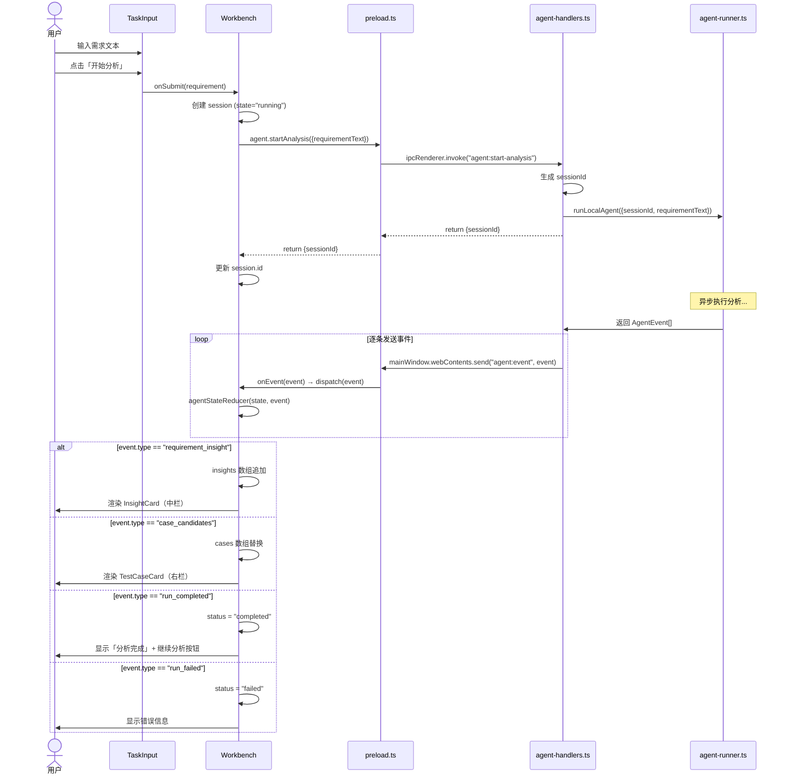
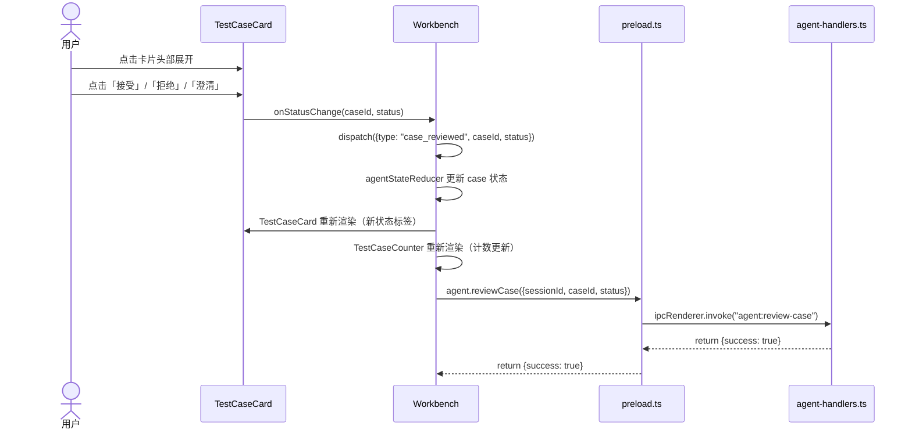
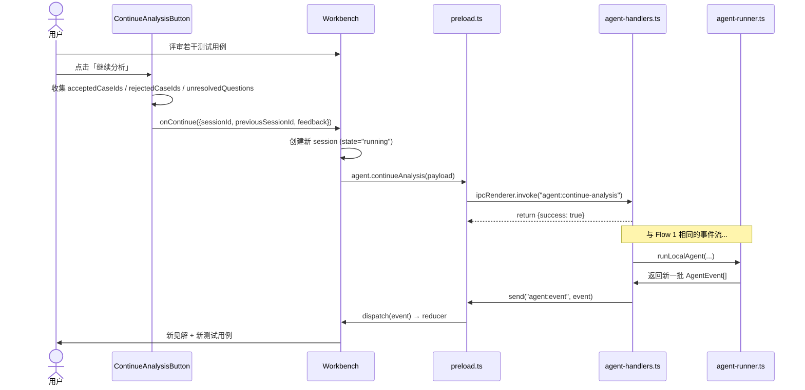
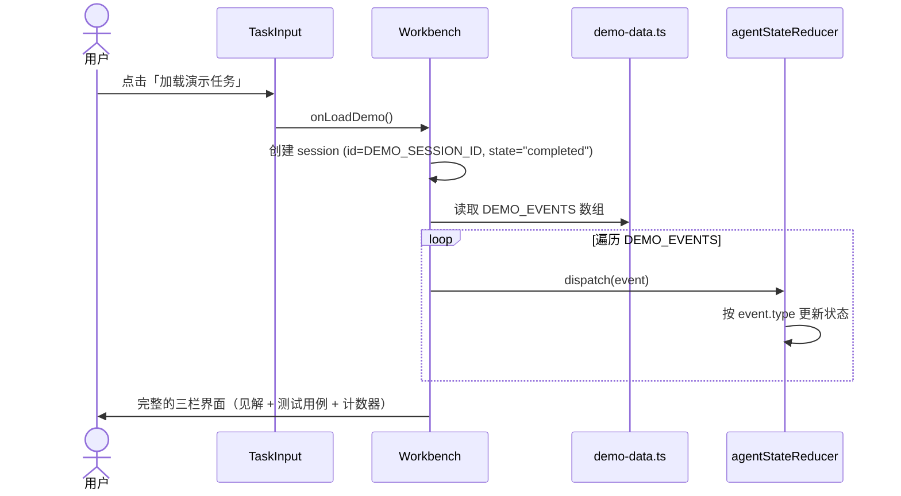
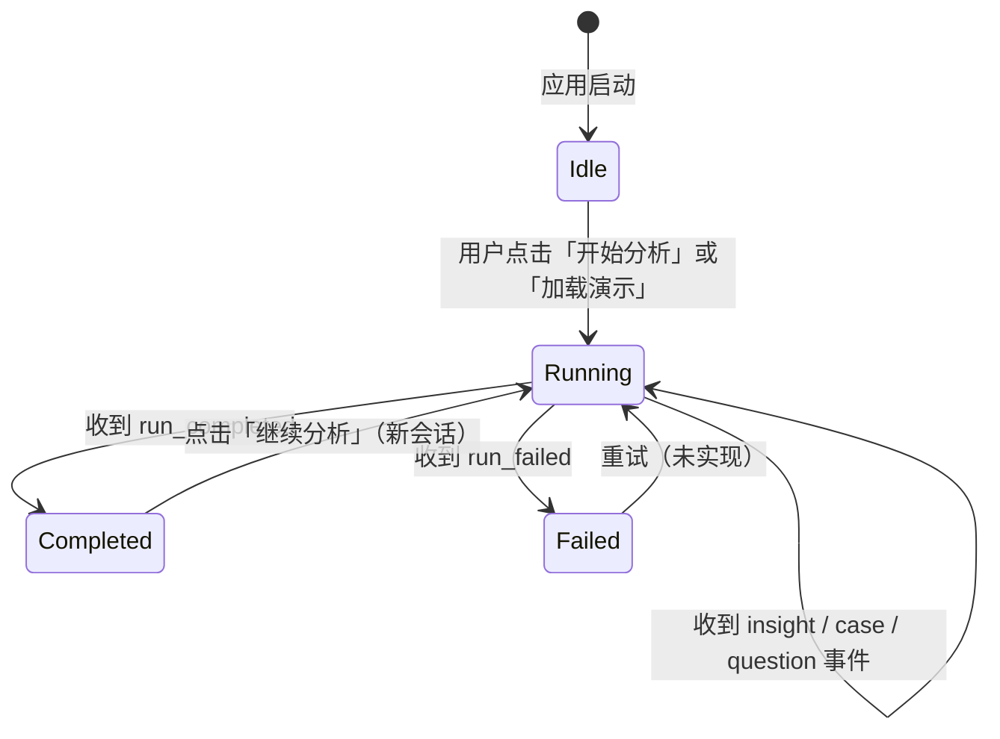
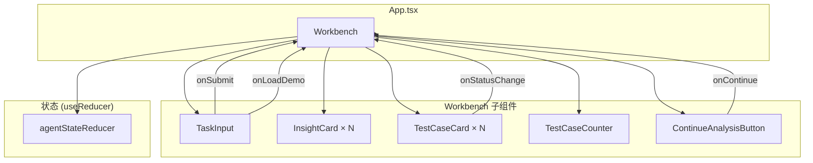

# Windhoox 架构文档

> 本文档描述 Windhoox 的系统架构、核心流程和数据模型。阅读本文后，开发者应能感知项目的整体骨架，并能独立地在任意一层添加或修改功能。

---

## 1. 系统概述

### 1.1 产品定位

Windhoox 是一款**本地运行的桌面应用**，帮助产品经理、工程师和测试人员将需求描述转化为结构化的测试设计资产。核心工作流为：

```
需求描述 → AI 代理分析 → 业务规则/风险见解 + 测试用例 → 人工评审 → 迭代优化
```

### 1.2 技术栈

| 层级 | 技术 | 说明 |
|------|------|------|
| 桌面框架 | Electron | 主进程 + 预加载脚本 + 渲染进程 |
| 前端框架 | React 19 | 函数组件 + Hooks |
| 构建工具 | Vite 8 | 热更新、快速打包 |
| 类型系统 | TypeScript 6 | 全项目类型化 |
| 测试框架 | Vitest | 单元测试 + 组件测试 |
| 自动更新 | electron-updater | GitHub Releases 渠道 |

### 1.3 设计原则

| 原则 | 说明 |
|------|------|
| **本地优先** | 所有数据存储在本地文件系统，不上传云端 |
| **安全隔离** | 渲染进程无权直接访问 Node.js API，通过 `contextBridge` 暴露受限 API |
| **事件驱动** | 整个 UI 由 Agent 事件流驱动，而非轮询 |
| **类型安全** | IPC 消息、Agent 事件、状态模型均使用 TypeScript 严格类型 |

---

## 2. 进程架构

### 2.1 三层进程模型

```mermaid
flowchart TB
    subgraph R["渲染进程 (Renderer) — Chromium"]
        direction TB
        REACT["React App"]
        COMP["组件层\nWorkbench / TaskInput / InsightCard / TestCaseCard"]
        STATE["状态层\nagent-state.ts (Reducer)"]
    end

    subgraph P["预加载脚本 (Preload) — 安全桥梁"]
        BRIDGE["contextBridge\nwindow.windhoox.agent"]
    end

    subgraph M["主进程 (Main) — Node.js"]
        direction TB
        IPC["ipcMain 处理器\nagent-handlers.ts"]
        RUNNER["Agent 执行器\nagent-runner.ts"]
        WINDOW["BrowserWindow"]
    end

    REACT --> COMP --> STATE
    STATE -->|调用 API| BRIDGE
    BRIDGE <-->|IPC 消息| IPC
    IPC --> RUNNER
    IPC -->|send("agent:event")| WINDOW
    WINDOW -->|推送事件| BRIDGE
    BRIDGE -->|onEvent| STATE
```

### 2.2 安全模型

| 配置 | 值 | 说明 |
|------|-----|------|
| `contextIsolation` | `true` | 渲染进程与预加载脚本的上下文隔离 |
| `nodeIntegration` | `false` | 渲染进程无法直接访问 Node.js |
| `sandbox` | `false` | 预加载脚本需要访问文件系统（加载会话） |
| `preload` | `preload.js` | 通过 `contextBridge` 暴露白名单 API |

> ⚠️ `sandbox: false` 是有意为之的权衡。预加载脚本需要读写本地会话文件，完全沙箱化会阻断这一能力。安全由 `contextBridge` 的白名单机制保证。

### 2.3 IPC 通道

| 通道 | 方向 | 调用方式 | 说明 |
|------|------|----------|------|
| `agent:start-analysis` | Renderer → Main | `invoke` | 启动新的分析会话 |
| `agent:continue-analysis` | Renderer → Main | `invoke` | 基于反馈继续迭代分析 |
| `agent:review-case` | Renderer → Main | `invoke` | 提交测试用例评审结果 |
| `agent:load-session` | Renderer → Main | `invoke` | 加载历史会话 |
| `agent:event` | Main → Renderer | `send` | 流式推送 Agent 进度事件 |

---

## 3. 核心流程

以下 4 个流程覆盖应用的全部用户交互路径。每个流程都配有 Mermaid 序列图，展示跨进程的消息流。

### 3.1 Flow 1 — 新建分析会话

用户输入需求，Agent 开始分析，结果逐步流式展示到三栏界面。



#### 关键代码路径

| 步骤 | 文件 | 函数/代码 |
|------|------|----------|
| 触发分析 | `src/renderer/components/TaskInput.tsx` | `handleSubmit` → `onSubmit(requirement)` |
| 调用 Agent API | `src/renderer/components/Workbench.tsx` | `handleStartAnalysis` |
| IPC 桥接 | `src/preload/preload.ts` | `startAnalysis: (payload) => ipcRenderer.invoke(...)` |
| 主进程处理 | `src/main/agent-handlers.ts` | `ipcMain.handle("agent:start-analysis", ...)` |
| Agent 执行 | `src/main/agent-runner.ts` | `runLocalAgent(input)` |
| 事件回推 | `src/main/agent-handlers.ts` | `mainWindow?.webContents.send("agent:event", event)` |
| 状态更新 | `src/renderer/state/agent-state.ts` | `agentStateReducer(state, event)` |
| UI 渲染 | `src/renderer/components/Workbench.tsx` | 根据 `agentState` 条件渲染 |

### 3.2 Flow 2 — 测试用例评审

用户展开测试用例卡片，选择接受/拒绝/澄清，状态实时更新。



#### 关键特性

- **乐观更新**：本地状态在调用 IPC 前就已经更新，UI 响应零延迟
- **状态流转**：`pending` → `accepted` / `rejected` / `ask_product` / `ask_engineering` / `needs_context`
- **计数联动**：`TestCaseCounter` 根据 `agentState.cases` 实时计算各状态数量

### 3.3 Flow 3 — 迭代继续分析

用户基于已有评审结果，发起新一轮更精准的分析。



#### 关键特性

- **状态重置 + 合并**：新会话开始后，旧的 `insights` 和 `cases` 会被新事件替换（`case_candidates` 事件直接覆盖 `cases` 数组），但用户已评审的状态会保留（需要事件协议扩展支持）
- **反馈闭环**：上一轮接受的用例会被 Agent 作为「正确示例」参考，拒绝的用例则作为「反面教材」

### 3.4 Flow 4 — 演示模式

无需后端 Agent，一键加载完整演示数据，用于快速体验 UI 能力。



#### 关键特性

- **零延迟**：所有数据在内存中，无需 IPC 往返
- **完整覆盖**：包含 `run_started`、`reading_sources`、`requirement_insight`、`missing_questions`、`case_candidates`、`coverage_matrix`、`run_completed` 全部事件类型
- **场景**：电商支付系统（支付宝/微信/银行卡，200 元阈值，短信验证）

---

## 4. Agent 事件协议

### 4.1 事件类型总览

所有 Agent 与 UI 的通信通过 `AgentEvent` 联合类型完成，定义于 `src/types/agent.ts`。

| 事件类型 | 何时触发 | 状态影响 | UI 效果 |
|---------|---------|---------|---------|
| `run_started` | 分析会话开始 | 初始化 `AgentState` | 显示「分析中...」 |
| `reading_sources` | Agent 读取上下文文件 | 无（当前 reducer 忽略） | 可作为进度指示 |
| `requirement_insight` | 提取到业务规则/风险 | `insights` 追加 | 渲染 InsightCard |
| `missing_questions` | 发现需求缺口 | `questions` 替换 | **当前未渲染** |
| `case_candidates` | 生成测试用例 | `cases` 替换 | 渲染 TestCaseCard |
| `coverage_matrix` | 需求-用例映射完成 | `coverage` 替换 | **当前未渲染** |
| `run_completed` | 分析正常结束 | `status = "completed"` | 显示完成状态 + 继续分析按钮 |
| `run_failed` | 分析失败 | `status = "failed"` | 显示错误信息 |
| `case_reviewed` | 用户评审用例 | 更新对应 case 的 `status` | 更新状态标签 + 计数器 |

### 4.2 状态机



### 4.3 AgentState 数据模型

```typescript
interface AgentState {
  sessionId: string;           // 当前会话 ID
  status: "idle" | "running" | "completed" | "failed";
  requirement: string;         // 原始需求文本
  insights: Array<{            // 分析见解
    id: string;
    businessRule?: string;
    risk?: string;
    evidence?: string;
    confidence: "high" | "medium" | "low";
  }>;
  questions: Array<{           // 待澄清问题
    id: string;
    category: "product" | "engineering" | "qa";
    question: string;
  }>;
  cases: Array<{               // 测试用例
    id: string;
    title: string;
    description: string;
    preconditions: string[];
    steps: string[];
    expectedResult: string;
    status: "pending" | "accepted" | "rejected" | "ask_product" | "ask_engineering" | "needs_context";
  }>;
  coverage: Array<{            // 覆盖矩阵
    requirementId: string;
    caseIds: string[];
  }>;
  error?: string;              // 失败时的错误信息
  artifacts?: {                // 产物文件路径
    conversationPath: string;
    insightPath: string;
    casesPath: string;
    coveragePath: string;
  };
}
```

### 4.4 Reducer 行为

`agentStateReducer` 位于 `src/renderer/state/agent-state.ts`，采用 Redux 风格的不可变更新：

| 事件 | Reducer 行为 |
|------|-------------|
| `run_started` | 全新状态对象，`sessionId`、`status`、`insights`、`cases` 全部重置 |
| `requirement_insight` | `insights` 数组追加新项（保留已有） |
| `missing_questions` | `questions` 数组替换为新列表 |
| `case_candidates` | `cases` 数组替换为新列表 |
| `coverage_matrix` | `coverage` 数组替换为新列表 |
| `run_completed` | `status = "completed"`，记录 `artifacts` |
| `run_failed` | `status = "failed"`，记录 `error` |
| `case_reviewed` | 遍历 `cases`，匹配 `caseId` 的项更新 `status` |

---

## 5. 组件架构

### 5.1 组件层次



### 5.2 各组件职责

| 组件 | 文件 | 职责 | 接收 Props |
|------|------|------|-----------|
| **Workbench** | `Workbench.tsx` | 三栏布局 orchestrator；持有 session 状态和 agentState；所有 IPC 调用的发起者 | 无（顶层） |
| **TaskInput** | `TaskInput.tsx` | 需求输入表单；支持加载演示任务 | `onSubmit`, `onLoadDemo?`, `isLoading` |
| **InsightCard** | `InsightCard.tsx` | 展示单条分析见解 | `businessRule?`, `risk?`, `evidence?`, `confidence` |
| **TestCaseCard** | `TestCaseCard.tsx` | 可展开/折叠的测试用例卡片；支持状态操作 | `testCase`, `onStatusChange` |
| **TestCaseCounter** | `TestCaseCounter.tsx` | 统计面板：待审核/已接受/已拒绝/需澄清 | `counts` |
| **ContinueAnalysisButton** | `ContinueAnalysisButton.tsx` | 收集评审反馈，发起新一轮分析 | `state`, `onContinue` |

### 5.3 状态所有权

| 状态 | 所有者 | 类型 | 说明 |
|------|--------|------|------|
| `session` | Workbench | `useState<Session \| null>` | 会话元数据（ID、状态、需求文本） |
| `agentState` | Workbench | `useReducer(agentStateReducer)` | 分析结果的全局状态 |
| `requirement` | TaskInput | `useState<string>` | 输入框的受控值 |
| `expanded` | TestCaseCard | `useState<boolean>` | 单个卡片的展开状态 |

---

## 6. 文件组织

### 6.1 目录结构

```
src/
├── main/                          # Electron 主进程（Node.js 环境）
│   ├── main.ts                    # 应用入口：创建窗口、注册处理器、初始化更新器
│   ├── updater.ts                 # 自动更新逻辑
│   ├── agent-handlers.ts          # IPC 处理器注册（4 个通道）
│   ├── agent-runner.ts            # Agent 执行器（当前为 Stub）
│   └── agent-runner.test.ts       # Agent 执行器测试
│
├── preload/                       # 预加载脚本（安全桥梁）
│   ├── preload.ts                 # 暴露 window.windhoox.agent API
│   └── preload.test.ts            # 预加载 API 测试
│
├── renderer/                      # React 前端（Chromium 环境）
│   ├── main.tsx                   # React DOM 挂载点
│   ├── App.tsx                    # 根组件
│   ├── styles.css                 # CSS 变量和设计令牌
│   ├── demo-data.ts               # 演示场景数据
│   ├── components/                # React 组件
│   │   ├── Workbench.tsx          # 三栏布局 orchestrator
│   │   ├── TaskInput.tsx          # 需求输入表单
│   │   ├── InsightCard.tsx        # 分析见解卡片
│   │   ├── TestCaseCard.tsx       # 测试用例卡片
│   │   ├── TestCaseCounter.tsx    # 状态计数器
│   │   └── ContinueAnalysisButton.tsx  # 继续分析按钮
│   └── state/                     # 状态管理
│       └── agent-state.ts         # Reducer + AgentState 类型
│
└── types/                         # 共享类型
    └── agent.ts                   # AgentEvent、Payload、Listener 类型
```

### 6.2 关键文件速查

| 文件 | 责任域 | 修改频率 |
|------|--------|---------|
| `src/types/agent.ts` | 协议契约 | 低 — 变更影响全系统 |
| `src/renderer/state/agent-state.ts` | 状态机 | 中 — 新增事件类型时需更新 |
| `src/main/agent-handlers.ts` | IPC 入口 | 中 — 新增通道时注册 |
| `src/main/agent-runner.ts` | Agent 实现 | 高 — 核心智能能力在此 |
| `src/preload/preload.ts` | API 白名单 | 低 — 新增暴露方法时更新 |
| `src/renderer/components/Workbench.tsx` | UI 编排 | 高 — 新功能的主入口 |

---

## 7. 开发指南

### 7.1 如何添加新的 IPC 通道

以添加 `agent:export-report` 为例：

**Step 1 — 定义类型** (`src/types/agent.ts`)
```typescript
export interface ExportReportPayload {
  sessionId: string;
  format: "pdf" | "markdown" | "json";
}
```

**Step 2 — 注册处理器** (`src/main/agent-handlers.ts`)
```typescript
ipcMain.handle("agent:export-report", async (_event, payload: ExportReportPayload) => {
  // 实现导出逻辑
  return { filePath: "/path/to/report.pdf" };
});
```

**Step 3 — 暴露到渲染进程** (`src/preload/preload.ts`)
```typescript
const agentApi = {
  // ... 现有方法
  exportReport: (payload: ExportReportPayload) =>
    ipcRenderer.invoke("agent:export-report", payload),
};
```

**Step 4 — 组件中使用** (`src/renderer/components/*.tsx`)
```typescript
const result = await agentApi.exportReport({ sessionId, format: "pdf" });
```

### 7.2 如何添加新的 Agent 事件类型

以添加 `test_plan_generated` 事件为例：

**Step 1 — 定义类型** (`src/types/agent.ts`)
```typescript
export interface TestPlanGeneratedEvent {
  type: "test_plan_generated";
  sessionId: string;
  plan: { phase: string; tasks: string[] }[];
  timestamp: number;
}

// 添加到 AgentEvent 联合类型
export type AgentEvent =
  | ...existing types
  | TestPlanGeneratedEvent;
```

**Step 2 — 更新 Reducer** (`src/renderer/state/agent-state.ts`)
```typescript
export interface AgentState {
  // ... 现有字段
  plan?: { phase: string; tasks: string[] }[];
}

// 在 switch 中添加 case
case "test_plan_generated": {
  const s = ensureState(state, event.sessionId);
  return { ...s, plan: event.plan };
}
```

**Step 3 — 更新 UI** (`src/renderer/components/Workbench.tsx`)
在渲染逻辑中读取 `agentState.plan` 并渲染对应组件。

### 7.3 如何添加新的组件

**Step 1 — 创建组件文件**
```
src/renderer/components/MyComponent.tsx
src/renderer/components/MyComponent.css
src/renderer/components/MyComponent.test.tsx
```

**Step 2 — 遵循现有模式**
- 使用函数组件 + TypeScript 接口定义 Props
- CSS 使用项目定义的 CSS 变量（见 `styles.css`）
- 测试使用 Vitest + @testing-library/react

**Step 3 — 在 Workbench 中引入**
```typescript
import { MyComponent } from "./MyComponent";

// 在渲染逻辑中使用
{agentState?.plan && <MyComponent plan={agentState.plan} />}
```

---

## 8. 已知限制与路线图

### 8.1 当前限制

| 限制 | 影响 | 优先级 |
|------|------|--------|
| `agent-runner.ts` 是 Stub | 无真实 AI 分析能力 | 🔴 高 |
| `missing_questions` 未渲染 | 用户看不到需求缺口 | 🟡 中 |
| `coverage_matrix` 未渲染 | 覆盖分析不可见 | 🟡 中 |
| 会话无法持久化 | 关闭应用后数据丢失 | 🟡 中 |
| `continue-analysis` / `review-case` / `load-session` 是 Stub | 迭代流程不完整 | 🟡 中 |

### 8.2 扩展方向

1. **真实 Agent 接入**：替换 `agent-runner.ts` 中的 Stub，接入本地 LLM（如 Ollama）或云端 API
2. **会话持久化**：实现 `sessions/{sessionId}/` 目录读写，支持加载历史会话
3. **问题澄清 UI**：在 Workbench 中渲染 `questions` 数组，允许用户在线回答
4. **覆盖矩阵可视化**：用矩阵表格展示需求 ↔ 用例的覆盖关系
5. **文件上下文选择器**：允许用户在 TaskInput 中选择本地代码文件作为分析上下文
