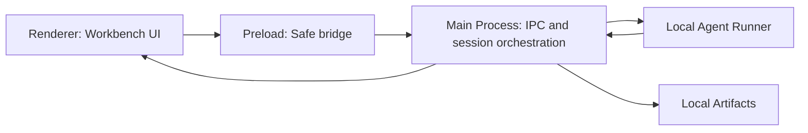

# Local Agent Test Design Workbench Plan

## Goal

Build the core of a local desktop tool for product, engineering, and QA teams to turn requirements and local context into reviewable test design assets.

The feature is not a backend service and does not depend on HTTP APIs. The UI is an Electron workbench that calls a local Agent workflow, receives structured events, renders intermediate analysis, and saves artifacts locally.

## Product Definition

The tool should behave like a local Agent-driven workbench:

- Users create a test design task from requirement text and optional local context.
- The Agent analyzes requirements, code references, API notes, and prior issue context.
- The UI shows the Agent's progress, insights, missing questions, candidate cases, and coverage.
- Users review candidate test cases and mark them as accepted, rejected, or needing input.
- The Agent can continue from local artifacts and review decisions.

## Non-Goals

This implementation will not include:

- Backend API services.
- Static business mock data in production code.
- Login, permissions, or cloud sync.
- Multi-user collaboration.
- Full document parsing pipelines.
- Export to Excel, Feishu, or test management systems.
- Real SaaS-style project administration.

Tests may stub the Agent boundary. Product code should not rely on hard-coded business mock content.

## Target Architecture



## Core Modules

### Renderer

Responsibilities:

- Render the three-column workbench.
- Collect requirement input and optional context references.
- Display Agent state and structured Agent results.
- Let users review candidate test cases.
- Trigger iterative Agent follow-up actions.

### Preload

Responsibilities:

- Expose a narrow `window.windhoox.agent` API.
- Keep renderer access safe and explicit.
- Avoid exposing raw Node or filesystem APIs.

Proposed API:

```ts
window.windhoox.agent.startAnalysis(payload)
window.windhoox.agent.continueAnalysis(payload)
window.windhoox.agent.reviewCase(payload)
window.windhoox.agent.loadSession(sessionId)
window.windhoox.agent.onEvent(listener)
```

### Main Process

Responsibilities:

- Create and load local sessions.
- Call the local Agent runner.
- Convert Agent output into typed events.
- Persist artifacts.
- Forward progress and result events to the renderer.

### Local Agent Runner

Responsibilities:

- Accept task input and context references.
- Produce structured output events.
- Return failures in a recoverable shape.
- Support follow-up runs using existing session artifacts.

### Local Artifacts

Suggested layout:

```text
sessions/
  {sessionId}/
    session.json
    conversation.md
    insight.json
    questions.json
    cases.json
    coverage.json
    agent-events.jsonl
```

## Agent Event Protocol

Events should be structured. The renderer should not parse long natural-language blobs to infer fields.

```ts
type AgentEvent =
  | AgentRunStartedEvent
  | AgentSourceReadingEvent
  | RequirementInsightEvent
  | MissingQuestionsEvent
  | CaseCandidatesEvent
  | CoverageMatrixEvent
  | AgentRunCompletedEvent
  | AgentRunFailedEvent;
```

Required event categories:

- `run_started`: session and task metadata.
- `reading_sources`: current input or context being processed.
- `requirement_insight`: business rules, risks, evidence, confidence.
- `missing_questions`: product, engineering, or QA questions.
- `case_candidates`: generated candidate test cases.
- `coverage_matrix`: mapping between requirements and cases.
- `run_completed`: final status and artifact paths.
- `run_failed`: error, recovery guidance, and retry eligibility.

## Implementation Plan

Each step must follow this loop:

1. Write or update tests first.
2. Implement the smallest useful slice.
3. Run tests and typecheck.
4. Run GitNexus `detect_changes` before committing.
5. Commit only the current step.
6. Move to the next step.

## Step 1: Add Local Agent Bridge

Purpose:

Establish the local boundary between renderer, preload, and main process.

Tests first:

- Verify `window.windhoox.agent` exists in renderer tests.
- Verify `startAnalysis` can be called from the renderer boundary.
- Verify the main process registers the analysis IPC handler.

Implementation:

- Extend preload API with `windhoox.agent`.
- Add IPC channel names for Agent operations.
- Add minimal main-process handlers.
- Return a typed placeholder response only for plumbing, not business content.

Validation:

- Run renderer tests.
- Run typecheck.
- Run GitNexus staged change detection.

Commit:

```text
Add local agent bridge
```

## Step 2: Add Empty Workbench Shell

Purpose:

Replace the welcome screen with the core three-column local Agent workbench in an empty state.

Tests first:

- Verify the workbench shell renders.
- Verify empty task state is shown.
- Verify the Agent input panel is shown.
- Verify the test asset pool empty state is shown.

Implementation:

- Add left task/context panel shell.
- Add center Agent analysis shell.
- Add right test asset pool shell.
- Do not add business mock data.

Validation:

- Run renderer tests.
- Run typecheck.
- Open the app locally and check the layout.
- Run GitNexus staged change detection.

Commit:

```text
Add empty agent workbench shell
```

## Step 3: Add Local Analysis Input Flow

Purpose:

Let users create a local analysis session from requirement text.

Tests first:

- Verify users can type requirement text.
- Verify the start button is disabled without input.
- Verify clicking start calls `startAnalysis` with the entered requirement.
- Verify running state is shown after submission.

Implementation:

- Add requirement input area.
- Add optional local context reference UI placeholders.
- Call the Agent bridge on start.
- Show session status: idle, running, failed, completed.

Validation:

- Run renderer tests.
- Run typecheck.
- Run GitNexus staged change detection.

Commit:

```text
Add local analysis input flow
```

## Step 4: Render Agent Events

Purpose:

Drive the UI from structured Agent events.

Tests first:

- Stub Agent events in tests.
- Verify `requirement_insight` renders insight cards.
- Verify `missing_questions` renders confirmation items.
- Verify `case_candidates` renders candidate test cases.
- Verify `run_failed` renders a recoverable error state.

Implementation:

- Define Agent event TypeScript types.
- Add renderer state reducer for Agent events.
- Render insight, questions, cases, and coverage from events.
- Persist event history through the main-process session layer.

Validation:

- Run renderer tests.
- Run typecheck.
- Run GitNexus staged change detection.

Commit:

```text
Render structured agent events
```

## Step 5: Connect Local Agent Runner

Purpose:

Replace placeholder plumbing with the actual local Agent execution path.

Tests first:

- Verify the runner receives session input.
- Verify runner output is converted into Agent events.
- Verify failed runner execution emits `run_failed`.
- Verify artifacts are written for a completed run.

Implementation:

- Add an Agent runner adapter in the main process.
- Stream or batch runner output as structured events.
- Save raw conversation and structured artifacts.
- Keep the runner swappable so future Agent implementations can replace it.

Validation:

- Run main/preload tests.
- Run renderer tests.
- Run typecheck.
- Run GitNexus staged change detection.

Commit:

```text
Connect local agent runner
```

## Step 6: Add Test Case Review Workflow

Purpose:

Let users turn Agent-generated candidate cases into reviewed local test assets.

Tests first:

- Verify accepting a case changes its status to `accepted`.
- Verify rejecting a case changes its status to `rejected`.
- Verify `ask_product`, `ask_engineering`, and `needs_context` statuses are supported.
- Verify accepted, pending, and gap counters update from real case state.

Implementation:

- Add review actions to candidate case cards.
- Save review decisions to the session artifact.
- Recompute asset pool counters from case state.
- Keep status transitions local and deterministic.

Validation:

- Run renderer tests.
- Run typecheck.
- Run GitNexus staged change detection.

Commit:

```text
Add local case review workflow
```

## Step 7: Add Iterative Agent Follow-Up

Purpose:

Let users continue analysis after reviewing generated cases.

Tests first:

- Verify follow-up prompt calls `continueAnalysis`.
- Verify payload includes session id, review decisions, and pending questions.
- Verify newly generated cases append or merge into the current session.

Implementation:

- Add follow-up input in the center panel.
- Include current session artifacts in follow-up requests.
- Merge returned insights, questions, cases, and coverage.
- Preserve prior review history.

Validation:

- Run renderer tests.
- Run typecheck.
- Run GitNexus staged change detection.

Commit:

```text
Add iterative agent follow-up flow
```

## Step 8: Match The Design Mockup

Purpose:

Bring the core implementation visually in line with the approved design.

Tests first:

- Verify the main three regions render.
- Verify key controls render in the expected states.
- Verify no core region disappears in the target desktop viewport.

Implementation:

- Apply the light, dense, three-column visual system.
- Style empty, running, failed, and completed states.
- Keep layout stable for desktop use.
- Avoid adding non-core features.

Validation:

- Run renderer tests.
- Run typecheck.
- Open the app locally and capture a screenshot.
- Run GitNexus staged change detection.

Commit:

```text
Style local agent workbench
```

## Final Verification

After all steps:

- Run full test suite.
- Run typecheck.
- Run a local smoke test in the app.
- Verify local artifacts are written and reloaded.
- Verify no backend API dependency exists.
- Run GitNexus `detect_changes`.
- Create a final cleanup commit only if necessary.

## Implementation Notes

- Keep production code free of business mock data.
- It is acceptable for tests to stub Agent events and Agent responses.
- Prefer typed event reducers over ad hoc UI state updates.
- Save artifacts in stable JSON shapes so Agent runs can be resumed.
- Keep the Agent runner adapter narrow and replaceable.
- Do not over-split components before the core flow stabilizes.
